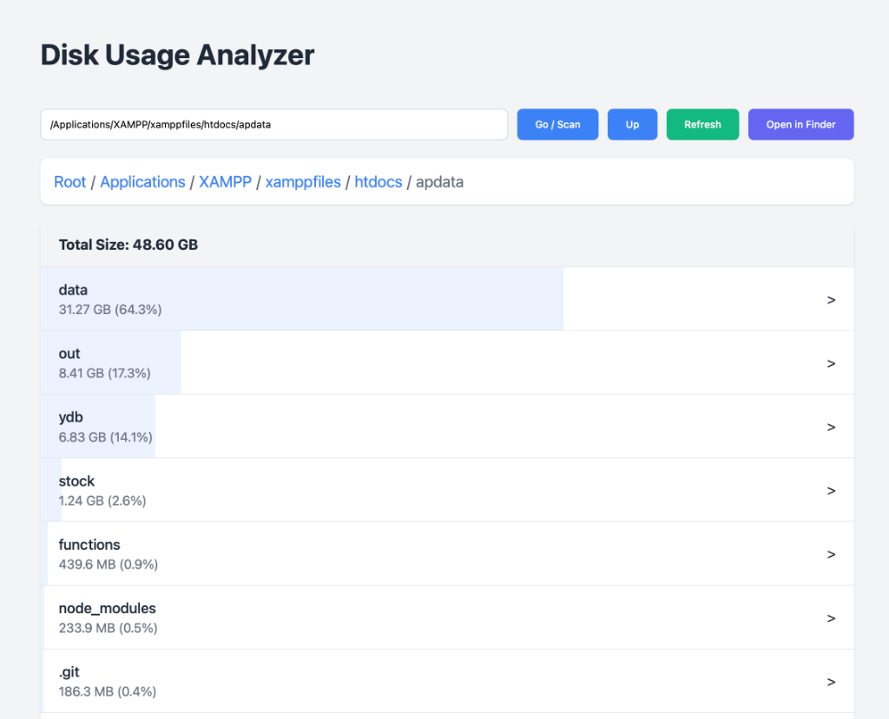

# Disk Usage Analyzer for macOS



A lightweight, **localhost web-based tool** designed to help you visualize and analyze disk usage on your Mac. It provides a convenient interface to explore your file system and identify what is taking up the most space.

**Note:** This is a **read-only** analysis tool. It does **not** have any functionality to delete or modify files. Its sole purpose is to help you *find* large files/folders so you can decide what to do with them manually.

## Features

*   **Recursive Size Analysis:** Uses the native `du` command to accurately calculate directory sizes.
*   **Caching System:** Caches directory sizes to `disk_data.json` for instant subsequent access. Only rescans when you explicitly request a refresh or navigate deeper.
*   **Finder Integration:** Open any directory directly in Finder with a single click to manage your files.
*   **Visual Interface:** Clean web UI with size bars and percentage indicators to easily spot large directories.
*   **Progress Tracking:** Real-time progress updates during scanning.

## How to Use

1.  **Install Dependencies:**
    ```bash
    npm install
    ```

2.  **Start the Server:**
    ```bash
    npm start
    ```
    This will start the local server (usually on port 3000) and automatically open the tool in your default browser.

3.  **Analyze:**
    *   Enter a path to scan (default is your project root).
    *   Click folders to navigate deeper.
    *   Use the **"Open in Finder"** button to inspect a folder in macOS.
    *   Use **"Refresh"** to force a recalculation of the current directory's size.

## Requirements

*   macOS (relies on macOS-specific `du` and `open` commands)
*   Node.js
